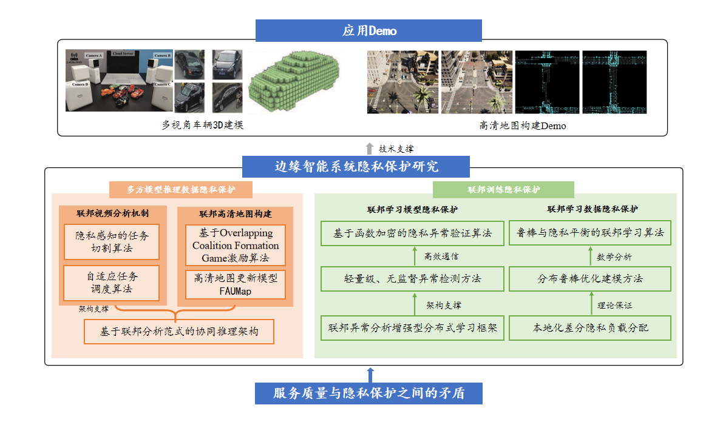

<!--



  

-->

Collaborative Optimization of Hardware and Software in Edge Intelligent System
------
The conflict between the polymorphic resource demands of intelligent applications and the singular resources of edge devices is mainly reflected in the supply and demand contradictions of computing hardware resources, communication hardware resources, and communication software resources. We designed a dual-computing resource edge intelligent chip and collaborative software optimization technology to provide dynamic and polymorphic computing resources for intelligent applications. Additionally, we designed various IoT data collection chips along with supporting software architectures and algorithms to offer communication resources with various power consumption ratios, meeting the diverse communication channel requirements of intelligent applications and minimizing data transmission costs.

- Dual computing resource edge intelligent chip
- Iot data collection chip for channel sharing

Accelerated Optimization of Edge Intelligent Systems
------
The conflict between the high workload of intelligent tasks and the limited resources of edge devices is mainly reflected in the need for substantial computing and communication resources to support low latency. However, edge devices often lack these resources, preventing timely completion of intelligent tasks. Current methods, such as model pruning and compression, reduce model size on edge devices but sacrifice accuracy for lower latency.

We propose targeted edge-cloud collaborative acceleration architectures for both the inference and training phases of intelligent applications. By optimizing task allocation, decomposing algorithms, and leveraging the cloud's computing power to handle common tasks, we reduce the computational burden on the edge, ensuring accuracy while accelerating task execution.

- Model inference acceleration based on task segmentation and data-driven assignment
- Hierarchical Federated Learning Acceleration

Privacy Protection of Edge Intelligent Systems
------
In edge intelligence scenarios, there is a conflict between service quality and privacy protection. Ensuring the quality of intelligent applications, such as low inference latency and high training accuracy, often requires sacrificing data and model privacy. To address this conflict, we propose targeted privacy-preserving architectures and mechanisms based on the federated learning paradigm for both the inference and training phases of intelligent applications. These solutions aim to maximize privacy protection for data and models while maintaining the service quality of intelligent applications.

- Multi-party model inference data privacy protection
- Models and data privacy protection in federated learning

